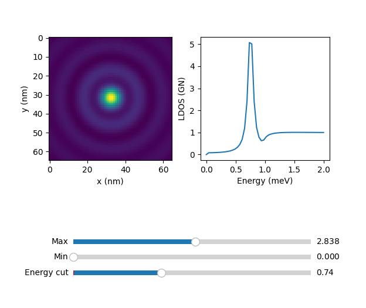
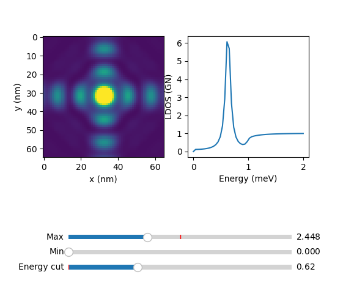
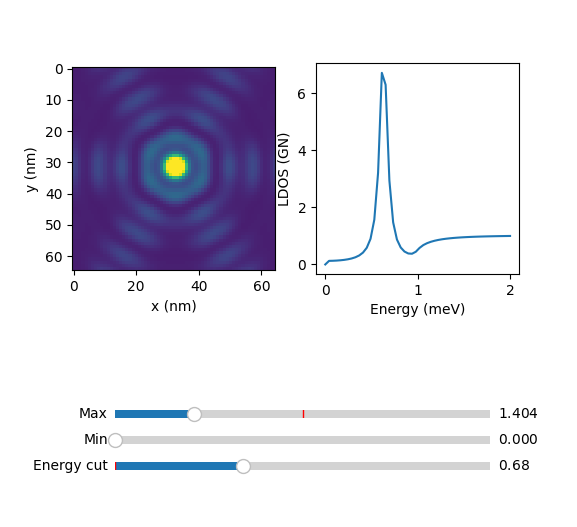

## Scripting

For quick start-up we follow with examples of LDOS calculations.

After installation, import the package and matplotlib with:

    import green_ysr as gr
    import matplotlib.pyplot as plt

### Single atom

Calculation of the surface BCS spectrum and a single classical spin impurity.

Initialize the surface with:

    surface = gr.lattice(type='atom',alpha=0)

Initialize the atom with:

    atom = gr.lattice(type='atom',alpha=0.05)

In the last two codechunks alpha is the adimensional exchange coupling, 0 for the bare surface dos and finite for the atom. The rest of the arguments are implicit and can be modified if needed (see reference).

To calculate the density of states:

    surface.didv([0,0])

where [0,0] is the position where the spectrum is measured.

Plot of the result:

    plt.plot(surface.E*1e3,surface.didv([0,0]))
    plt.plot(atom.E*1e3,atom.didv([0,0]))

    # for cosmetics
    plt.xlabel('Energy (meV)')
    plt.ylabel('LDOS (Gn)')
    plt.xlim()
    gr.set_size_cm(8,5)
    plt.tight_layout()

this should show the spectrum with the YSR resonance:

To compute the convolution with a superconducting tip the didv_conv function is used instead:

    plt.plot(surface.V*1e3,surface.didv_conv([0,0]))
    plt.plot(atom.V*1e3,atom.didv_conv([0,0]))

    plt.xlabel('Energy (meV)')
    plt.ylabel('LDOS (Gn)')
    plt.tick_params(axis='both',direction='in')
    gr.set_size_cm(8,5)
    plt.tight_layout()

this should produce this plot:

### Fermi surface anisotropy

The Fermi surface contour shape can be set as circular, squared or hexagonal (mode=1,2,3 respectively). Next you find an example, the calculation of the LDOS at the YSR energy in the vicinity of one isolated impurity, with the three different Fermi surface contours.

Initializing the simulation of a single atom with a circular contour (mode=0, default):

    atom = gr.lattice(type='atom',alpha=0.04,E_px=50,E_range=[0,2],mode=0)

Calculation of the LDOS in squared grid (80x80 a0):

    atom.map_coord_gen(64,80) 
    atom.didv_map_calc()

the result is a 64x64x50 numpy ndarray stored in:

    atom.didv_map()

a quick visualization of the result can be done with:

atom.explorer()

where the slider 'Energy cut' serves to plot the constant energy cuts of the 64x64 grid.

For the squared and fermi contour, change the mode parameter to 2 and 3. For mode = 2, with the same commands you should see:

For mode = 3 :

In the next sections we will show examples on lattices with circular Fermi surface, but 
### Dimer

For a dimer we ser N=2 and the pitch_x as the distance between the two atoms in atomic units (Bohr radius). The atoms of the dimer have coordinates ([0,0],[0,8]).

    dimer = gr.lattice(N=2,type='1D',pitch_x=8,alpha=0.05)

Doing the same calculation in [0,0] and plot you should see:

A quick function to calculate the dos along the dimer axis is:

    dimer.linescan(3)

That results in the even-odd superposition of YSR states.

### Saving results

There is the possibility of saving and loading simulations. To save the dimer simulation above just add:

    gr.sim_save(dimer)

this stores the result in the /out folder with an generated filename, containing information of the simulation. It can be loaded using:

    dimer = uf.load_obj(fname)

where fname is the path of the saved file without extension.

### Chains

The extension from dimers to chains is straightfarward, since one only needs to increment N and specify the chain direction:

    chain = gr.lattice(N=10,type='1D',pitch_x=6.3,alpha=0.07,U=0.07)

The chain is 10 atoms along the horizontal direction with distance 6.3 a0. We introduced here a finite potential scattering U to better visualize the quantum well states. To compute a line of spectra along the chain:

    chain.linescan(5)

with 5 the resolution, 5 spectra per atom. The result is stored in chain.LS and can be quicly visualized by:

    gr.plot_LS(chain)

that results in:

that you can save as explained above.

## Arbitrary lattice

Arbitrary atomic lattices can be simulated given a set of coordinates. For example a cross with 5 atoms with coordinates:

    cross_coords = (
        (0,0),
        (12.6,12.6),
        (-12.6,12.6),
        (12.6,-12.6),
        (-12.6,-12.6),
    )

To initialize the calculation:

    cross = gr.lattice(type='2D',N=5,coords=cross_coords,alpha=0.04,E_px=50,E_range=[0,2])

where we limited the energy points and range (didv is simmetric since particle-hole simmetry).

The .didv method can be used to calculate the LDOS in specific points (see above). To calculate the DOS in a squared grid around the structure (50.4x50.4 a0), first generate the grid points:

    cross.map_coord_gen(28,50.4)
    cross.show_lattice_map()

the second command with show the lattice toghether with the LDOS map points:

The first input is the spacing of the structure along x, the second is the number of pixel per line and the third is the lateral size of the map in units of the spacing.

To run the calculation and save it afterwards:

    cross.didv_map_calc()

    gr.sim_save(cross)

The DOS map is stored in cross.didv_map, and can be easily visualized with a built in function:

    cross.explorer()

that will show a slider based viewer:

